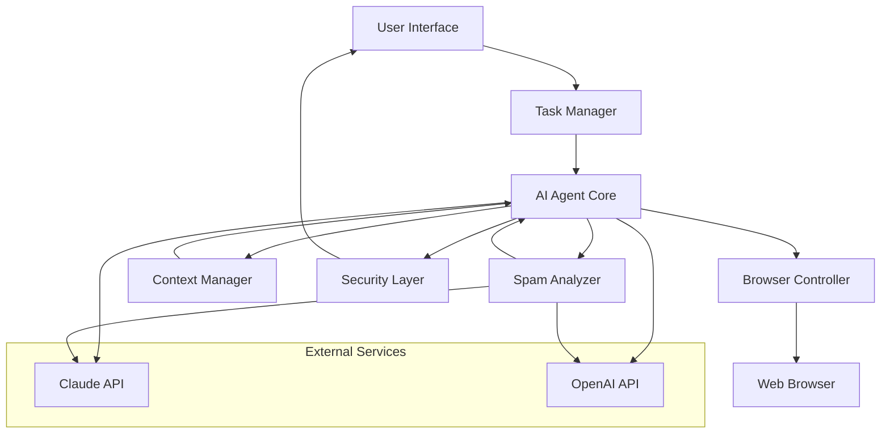
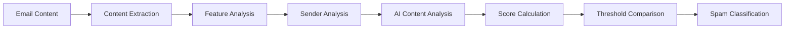

# AI Browser Agent Design Document

## Overview

The AI Browser Agent is a Python-based autonomous system that combines web browser automation with AI decision-making to execute complex multi-step tasks. The system uses Selenium WebDriver for browser control, integrates with AI models accessible in Russia (Claude/OpenAI), and implements intelligent content processing to work within token limitations.

## Architecture

### High-Level Architecture



### Component Interaction Flow

1. **Task Submission**: User submits task through UI
2. **Task Planning**: Task Manager creates execution plan
3. **AI Decision Loop**: AI Agent analyzes page content and decides actions
4. **Browser Control**: Browser Controller executes actions
5. **Context Management**: Context Manager optimizes content for AI processing
6. **Security Checks**: Security Layer validates destructive actions
7. **Status Updates**: UI provides real-time feedback

## Components and Interfaces

### 1. AI Agent Core

**Purpose**: Central decision-making component that orchestrates task execution

**Key Classes**:
- `AIAgent`: Main orchestrator class
- `TaskPlanner`: Converts user tasks into actionable steps
- `DecisionEngine`: Makes autonomous decisions based on web content
- `ModelInterface`: Abstracts AI model interactions

**Interfaces**:
```python
class AIAgent:
    def execute_task(self, task_description: str) -> TaskResult
    def analyze_page(self, page_content: PageContent) -> List[Action]
    def request_user_input(self, prompt: str) -> str
    def generate_report(self, actions: List[Action]) -> str

class TaskPlanner:
    def create_plan(self, task_description: str) -> ExecutionPlan
    def update_plan(self, current_state: BrowserState) -> ExecutionPlan
```

### 2. Browser Controller

**Purpose**: Manages web browser automation and interaction

**Key Classes**:
- `BrowserController`: Main browser automation interface
- `ElementLocator`: Finds and interacts with web elements
- `SessionManager`: Handles persistent browser sessions
- `PageAnalyzer`: Extracts structured data from web pages

**Interfaces**:
```python
class BrowserController:
    def navigate_to(self, url: str) -> None
    def find_element(self, selector: ElementSelector) -> WebElement
    def click_element(self, element: WebElement) -> None
    def fill_form(self, form_data: Dict[str, str]) -> None
    def get_page_content(self) -> PageContent
    def take_screenshot(self) -> bytes
```

### 3. Context Manager

**Purpose**: Optimizes web content for AI processing within token limits

**Key Classes**:
- `ContentExtractor`: Extracts relevant content from web pages
- `TokenOptimizer`: Manages content size for AI models
- `ContentSummarizer`: Creates concise summaries of page content
- `ElementPrioritizer`: Ranks page elements by relevance

**Interfaces**:
```python
class ContextManager:
    def extract_relevant_content(self, page: WebPage, task_context: str) -> str
    def optimize_for_tokens(self, content: str, max_tokens: int) -> str
    def prioritize_elements(self, elements: List[WebElement], task: str) -> List[WebElement]
```

### 4. Security Layer

**Purpose**: Provides safety mechanisms for potentially destructive actions

**Key Classes**:
- `ActionValidator`: Identifies potentially destructive actions
- `UserConfirmation`: Handles user approval workflows
- `SecurityConfig`: Manages security settings and rules
- `AuditLogger`: Logs security events and decisions

**Interfaces**:
```python
class SecurityLayer:
    def validate_action(self, action: Action) -> SecurityResult
    def request_confirmation(self, action: Action) -> bool
    def log_security_event(self, event: SecurityEvent) -> None
```

### 5. Spam Analyzer

**Purpose**: Provides intelligent spam detection with configurable thresholds

**Key Classes**:
- `SpamAnalyzer`: Main spam detection engine
- `ContentAnalyzer`: Analyzes email content for spam indicators
- `SenderAnalyzer`: Evaluates sender reputation and patterns
- `SpamScorer`: Calculates final spam probability scores
- `ThresholdManager`: Manages configurable spam detection thresholds

**Interfaces**:
```python
class SpamAnalyzer:
    def analyze_email(self, email_content: EmailContent) -> SpamAnalysisResult
    def calculate_spam_score(self, features: SpamFeatures) -> float
    def classify_as_spam(self, spam_score: float, threshold: float = 0.30) -> bool
    def get_analysis_details(self, email_content: EmailContent) -> SpamAnalysisDetails

class ContentAnalyzer:
    def extract_features(self, email_content: str) -> ContentFeatures
    def analyze_subject(self, subject: str) -> SubjectAnalysis
    def analyze_body(self, body: str) -> BodyAnalysis

class SenderAnalyzer:
    def analyze_sender(self, sender_email: str, sender_name: str) -> SenderAnalysis
    def check_domain_reputation(self, domain: str) -> DomainReputation
```

### 6. User Interface

**Purpose**: Provides communication channel between user and agent

**Key Classes**:
- `TerminalInterface`: Command-line interface implementation
- `WindowInterface`: Separate window interface (optional)
- `StatusReporter`: Real-time status updates
- `InputHandler`: Processes user commands and responses

## Data Models

### Core Data Structures

```python
@dataclass
class Task:
    id: str
    description: str
    status: TaskStatus
    created_at: datetime
    steps: List[TaskStep]
    context: Dict[str, Any]

@dataclass
class Action:
    type: ActionType
    target: str
    parameters: Dict[str, Any]
    is_destructive: bool
    confidence: float

@dataclass
class PageContent:
    url: str
    title: str
    text_content: str
    elements: List[WebElement]
    metadata: Dict[str, Any]

@dataclass
class ExecutionPlan:
    steps: List[TaskStep]
    current_step: int
    context: Dict[str, Any]
    fallback_strategies: List[str]

@dataclass
class EmailContent:
    subject: str
    sender_email: str
    sender_name: str
    body: str
    headers: Dict[str, str]
    timestamp: datetime
    attachments: List[str]

@dataclass
class SpamAnalysisResult:
    spam_score: float
    is_spam: bool
    confidence: float
    features_analyzed: List[str]
    analysis_details: Dict[str, Any]

@dataclass
class SpamFeatures:
    content_features: ContentFeatures
    sender_features: SenderFeatures
    metadata_features: MetadataFeatures

@dataclass
class ContentFeatures:
    suspicious_keywords_count: int
    caps_lock_ratio: float
    exclamation_count: int
    url_count: int
    suspicious_urls: List[str]
    language_quality_score: float

@dataclass
class SenderFeatures:
    domain_reputation: float
    sender_history_score: float
    is_known_sender: bool
    domain_age: Optional[int]
```

### Enumerations

```python
class TaskStatus(Enum):
    PENDING = "pending"
    IN_PROGRESS = "in_progress"
    COMPLETED = "completed"
    FAILED = "failed"
    REQUIRES_INPUT = "requires_input"

class ActionType(Enum):
    NAVIGATE = "navigate"
    CLICK = "click"
    TYPE = "type"
    SCROLL = "scroll"
    WAIT = "wait"
    EXTRACT = "extract"
```

## Error Handling

### Error Categories

1. **Browser Errors**: Page load failures, element not found, timeout errors
2. **AI Model Errors**: API failures, token limit exceeded, invalid responses
3. **Network Errors**: Connection failures, slow responses
4. **Task Errors**: Invalid task descriptions, impossible tasks
5. **Security Errors**: Blocked destructive actions, authentication failures

### Error Handling Strategies

```python
class ErrorHandler:
    def handle_browser_error(self, error: BrowserError) -> RecoveryAction
    def handle_ai_error(self, error: AIError) -> RecoveryAction
    def handle_network_error(self, error: NetworkError) -> RecoveryAction
    
    def retry_with_backoff(self, action: Action, max_retries: int = 3) -> ActionResult
    def fallback_strategy(self, failed_action: Action) -> List[Action]
```

### Recovery Mechanisms

- **Automatic Retry**: Retry failed actions with exponential backoff
- **Alternative Strategies**: Use different selectors or approaches for element interaction
- **User Escalation**: Request user assistance for unresolvable errors
- **Graceful Degradation**: Continue with partial task completion when possible

## Testing Strategy

### Unit Testing

- **Component Isolation**: Test each component independently with mocks
- **AI Model Mocking**: Mock AI responses for consistent testing
- **Browser Simulation**: Use WebDriver mocks for browser interaction tests

### Integration Testing

- **End-to-End Workflows**: Test complete task execution flows
- **Real Browser Testing**: Test with actual browser instances on test sites
- **AI Model Integration**: Test with real AI models using test prompts

### Test Scenarios

1. **Email Management**: Test spam detection and email organization
2. **Intelligent Spam Detection**: Test spam scoring algorithm with various email types and threshold configurations
3. **Online Ordering**: Test product search and cart management
4. **Error Recovery**: Test handling of various error conditions
5. **Security Validation**: Test destructive action prevention
6. **Context Management**: Test token optimization and content extraction

### Performance Testing

- **Response Time**: Measure task execution speed
- **Memory Usage**: Monitor browser and Python process memory
- **Token Efficiency**: Measure AI model token usage optimization
- **Concurrent Tasks**: Test multiple simultaneous task execution

## Spam Detection Algorithm

### Spam Analysis Pipeline

The spam detection system uses a multi-layered approach combining rule-based analysis with AI-powered content evaluation:



### Feature Analysis Components

1. **Content Analysis**:
   - Suspicious keyword detection (promotional terms, urgency indicators)
   - Text quality assessment (grammar, spelling, coherence)
   - URL analysis (suspicious domains, shortened links)
   - Formatting patterns (excessive caps, punctuation)

2. **Sender Analysis**:
   - Domain reputation scoring
   - Sender history evaluation
   - Email address pattern analysis
   - Authentication header validation (SPF, DKIM, DMARC)

3. **Metadata Analysis**:
   - Header analysis for spoofing indicators
   - Timestamp patterns
   - Routing information evaluation

### Scoring Algorithm

```python
def calculate_spam_score(features: SpamFeatures) -> float:
    # Weighted combination of feature scores
    content_weight = 0.4
    sender_weight = 0.35
    metadata_weight = 0.25
    
    content_score = analyze_content_features(features.content_features)
    sender_score = analyze_sender_features(features.sender_features)
    metadata_score = analyze_metadata_features(features.metadata_features)
    
    final_score = (
        content_score * content_weight +
        sender_score * sender_weight +
        metadata_score * metadata_weight
    )
    
    return min(max(final_score, 0.0), 1.0)  # Clamp to [0.0, 1.0]
```

### Threshold Configuration

- **Default Threshold**: 0.30 (configurable)
- **Conservative Mode**: 0.50 (fewer false positives)
- **Aggressive Mode**: 0.15 (catches more spam, more false positives)
- **Custom Thresholds**: User-configurable per email account

## Implementation Considerations

### AI Model Selection

- **Primary**: Claude API (Anthropic) - available in Russia
- **Fallback**: OpenAI API where accessible
- **Local Models**: Consider local LLM options for enhanced privacy

### Browser Automation

- **WebDriver**: Selenium WebDriver for cross-browser compatibility
- **Browser Choice**: Chrome/Chromium for best automation support
- **Session Persistence**: Use browser profiles for maintaining login sessions

### Content Processing

- **HTML Parsing**: BeautifulSoup for content extraction
- **Text Processing**: spaCy or NLTK for natural language processing
- **Image Analysis**: Optional OCR for image-based content
- **Spam Analysis**: Machine learning-based content analysis with AI model integration
- **Feature Extraction**: Statistical analysis of email content, sender patterns, and metadata

### Security Measures

- **Action Classification**: Rule-based system for identifying destructive actions
- **User Confirmation**: Clear prompts with action descriptions
- **Audit Trail**: Comprehensive logging of all actions and decisions
- **Sandboxing**: Consider containerization for enhanced security