# AI Browser Agent Architecture

## Table of Contents
- [System Overview](#system-overview)
- [Architecture Principles](#architecture-principles)
- [Component Architecture](#component-architecture)
- [Data Flow](#data-flow)
- [Integration Patterns](#integration-patterns)
- [Security Architecture](#security-architecture)
- [Performance Considerations](#performance-considerations)
- [Extensibility](#extensibility)

---

## System Overview

The AI Browser Agent is a modular, event-driven system that combines web browser automation with artificial intelligence to perform complex multi-step tasks autonomously. The architecture follows a layered approach with clear separation of concerns and well-defined interfaces between components.

### High-Level Architecture

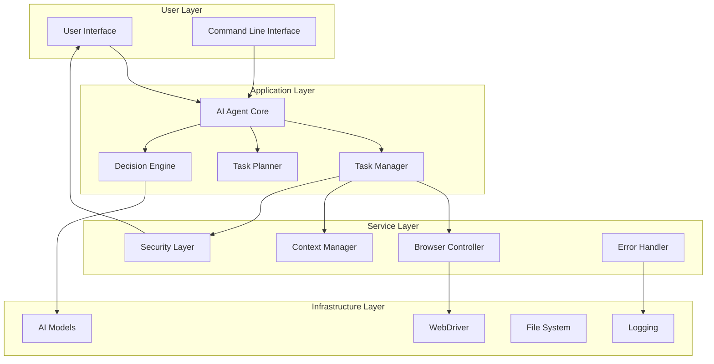

### Core Design Principles

1. **Modularity**: Each component has a single responsibility and well-defined interfaces
2. **Extensibility**: New AI models, browsers, and task handlers can be easily added
3. **Security**: Multi-layered security with user confirmation for destructive actions
4. **Reliability**: Comprehensive error handling and recovery mechanisms
5. **Performance**: Efficient context management and token optimization
6. **Observability**: Comprehensive logging and audit trails

---

## Architecture Principles

### Separation of Concerns

The system is divided into distinct layers, each with specific responsibilities:

- **Presentation Layer**: User interfaces and interaction handling
- **Business Logic Layer**: Task planning, decision making, and orchestration
- **Service Layer**: Browser control, security validation, and context management
- **Infrastructure Layer**: External integrations (browsers, AI APIs, file system)

### Dependency Injection

Components receive their dependencies through constructor injection, enabling:
- Easy testing with mock objects
- Runtime configuration of different implementations
- Loose coupling between components

```python
class AIAgent:
    def __init__(self, 
                 task_manager: TaskManager,
                 decision_engine: DecisionEngine,
                 security_layer: SecurityLayer,
                 user_interface: UserInterface):
        self.task_manager = task_manager
        self.decision_engine = decision_engine
        self.security_layer = security_layer
        self.user_interface = user_interface
```

### Interface-Based Design

All major components implement well-defined interfaces, allowing for:
- Multiple implementations (e.g., different AI models, browsers)
- Easy mocking for testing
- Runtime switching between implementations

```python
class AIModelInterface(ABC):
    @abstractmethod
    def generate_response(self, prompt: str, context: str) -> str:
        pass

class ClaudeModel(AIModelInterface):
    def generate_response(self, prompt: str, context: str) -> str:
        # Claude-specific implementation
        pass

class OpenAIModel(AIModelInterface):
    def generate_response(self, prompt: str, context: str) -> str:
        # OpenAI-specific implementation
        pass
```

### Event-Driven Architecture

The system uses an event-driven approach for:
- Status updates and progress reporting
- Error handling and recovery
- Security event logging
- User interaction requests

---

## Component Architecture

### AI Agent Core

The central orchestrator that coordinates all system components.

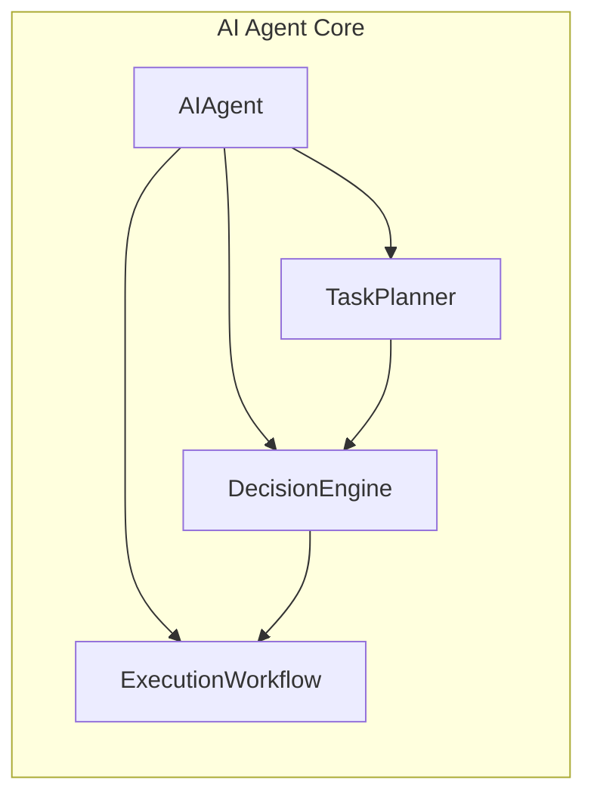

**Responsibilities:**
- Task orchestration and coordination
- Component lifecycle management
- Error handling and recovery coordination
- User interaction management

**Key Interfaces:**
- `AIAgent`: Main orchestrator interface
- `TaskPlanner`: Converts natural language to execution plans
- `DecisionEngine`: Makes autonomous decisions based on context
- `ExecutionWorkflow`: Manages task execution flow

### Browser Controller

Manages all browser automation and web interaction.

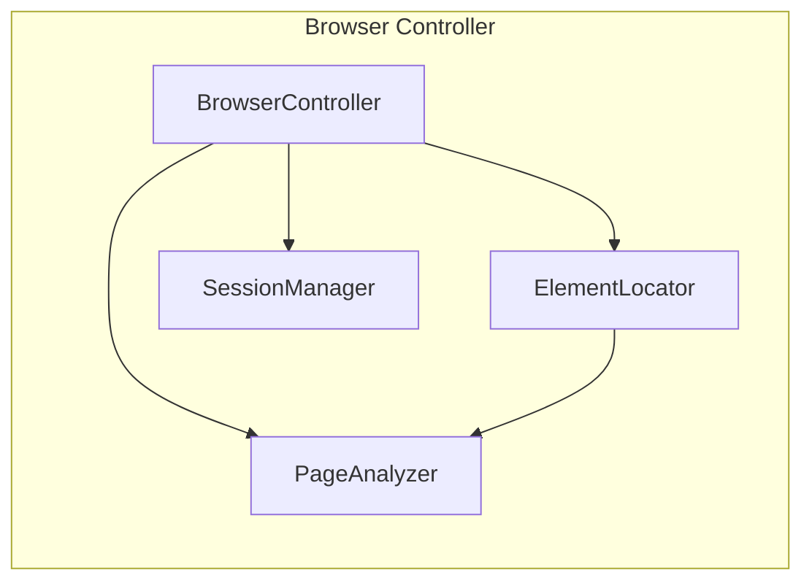

**Responsibilities:**
- WebDriver lifecycle management
- Element finding and interaction
- Page content extraction and analysis
- Session persistence and management

**Key Features:**
- Multiple element finding strategies
- Intelligent waiting and retry mechanisms
- Screenshot capture for debugging
- Session persistence across tasks

### Context Manager

Optimizes content for AI processing within token limits.

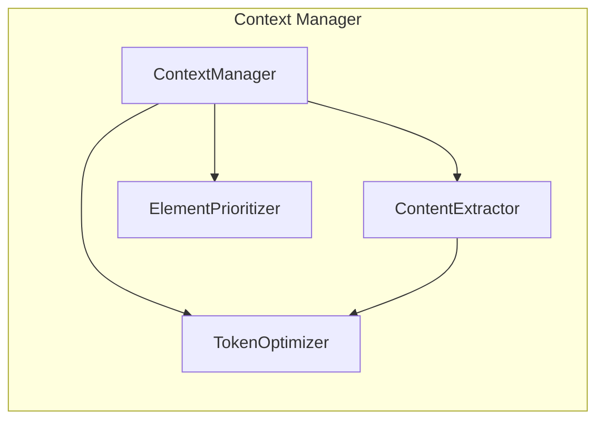

**Responsibilities:**
- Content extraction and filtering
- Token count estimation and optimization
- Element prioritization based on task relevance
- Context preparation for AI models

**Optimization Strategies:**
- Relevance-based content filtering
- Intelligent text summarization
- Element importance scoring
- Progressive content loading

### Security Layer

Provides comprehensive security validation and user confirmation.

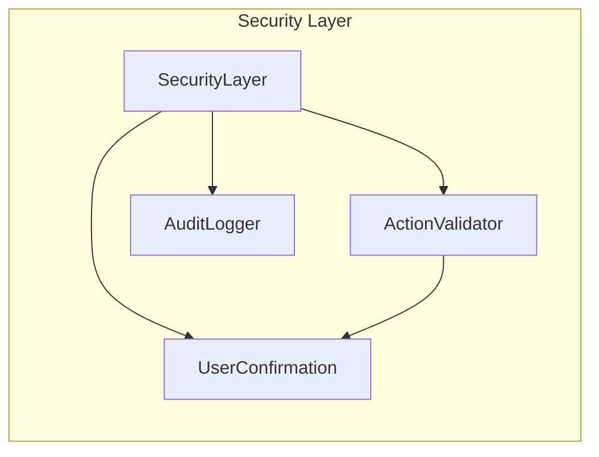

**Responsibilities:**
- Action risk assessment
- User confirmation workflows
- Security event logging
- Audit trail maintenance

**Security Features:**
- Multi-level risk assessment
- Configurable confirmation requirements
- Comprehensive audit logging
- Domain-based security policies

### Task Management

Orchestrates task execution and manages task state.

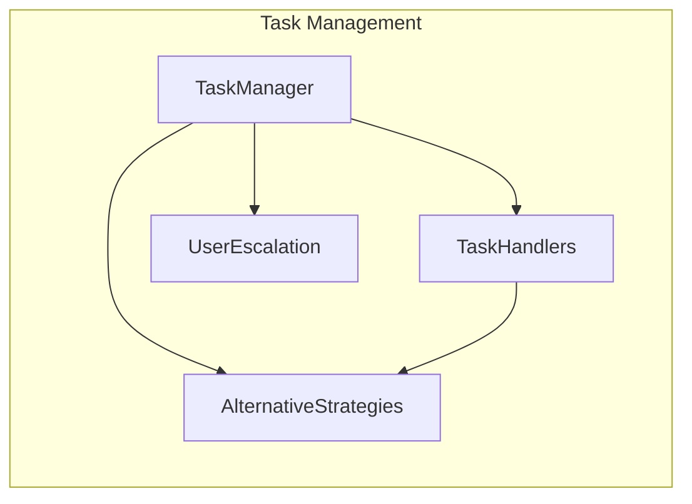

**Responsibilities:**
- Task execution orchestration
- Specialized task handler management
- Alternative strategy coordination
- User escalation handling

**Task Handler Types:**
- `EmailTaskHandler`: Email management operations
- `OrderingTaskHandler`: E-commerce and ordering tasks
- `GeneralTaskHandler`: Generic web automation tasks

---

## Data Flow

### Task Execution Flow

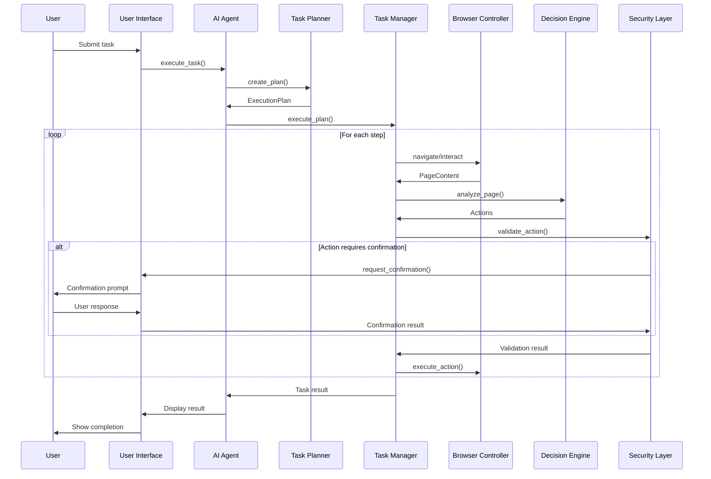

### Context Processing Flow

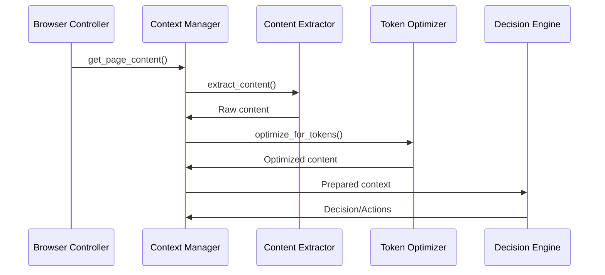

### Security Validation Flow

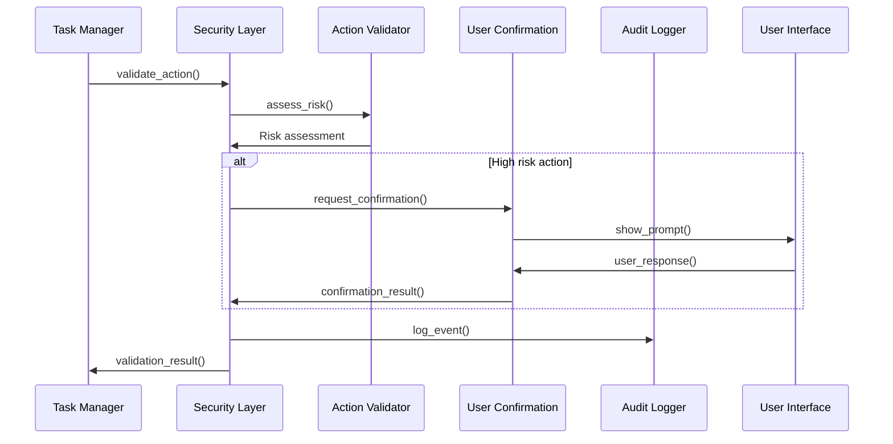

---

## Integration Patterns

### AI Model Integration

The system supports multiple AI models through a common interface:

```python
class ModelFactory:
    @staticmethod
    def create_model(model_type: str, config: AIModelConfig) -> AIModelInterface:
        if model_type == "claude":
            return ClaudeModel(config.claude_api_key)
        elif model_type == "openai":
            return OpenAIModel(config.openai_api_key)
        else:
            raise ValueError(f"Unsupported model type: {model_type}")
```

**Integration Features:**
- Automatic fallback between models
- Model-specific optimization
- Unified error handling
- Configuration-driven selection

### Browser Integration

WebDriver integration with multiple browser support:

```python
class BrowserFactory:
    @staticmethod
    def create_driver(browser_type: str, config: BrowserConfig) -> WebDriver:
        if browser_type == "chrome":
            return ChromeDriverManager().create_driver(config)
        elif browser_type == "firefox":
            return FirefoxDriverManager().create_driver(config)
        else:
            raise ValueError(f"Unsupported browser: {browser_type}")
```

**Browser Features:**
- Automatic driver management
- Profile persistence
- Custom configuration support
- Cross-platform compatibility

### Plugin Architecture

Extensible task handler system:

```python
class TaskHandlerRegistry:
    def __init__(self):
        self.handlers = {}
    
    def register_handler(self, task_type: str, handler: TaskHandler):
        self.handlers[task_type] = handler
    
    def get_handler(self, task_description: str) -> TaskHandler:
        task_type = self.classify_task(task_description)
        return self.handlers.get(task_type, self.default_handler)
```

---

## Security Architecture

### Multi-Layered Security

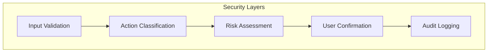

### Security Components

1. **Input Validation**
   - Task description sanitization
   - URL validation
   - Parameter validation

2. **Action Classification**
   - Destructive action detection
   - Sensitive domain identification
   - Pattern-based risk assessment

3. **Risk Assessment**
   - Multi-factor risk scoring
   - Context-aware evaluation
   - Dynamic risk thresholds

4. **User Confirmation**
   - Interactive confirmation prompts
   - Risk level communication
   - Timeout handling

5. **Audit Logging**
   - Comprehensive event logging
   - Security event tracking
   - Compliance reporting

### Security Policies

```python
@dataclass
class SecurityPolicy:
    require_confirmation_for_payments: bool = True
    require_confirmation_for_deletions: bool = True
    require_confirmation_for_modifications: bool = True
    sensitive_domains: List[str] = field(default_factory=list)
    max_task_duration: int = 3600
    audit_all_actions: bool = True
```

---

## Performance Considerations

### Token Optimization

Efficient AI model usage through:
- Content relevance filtering
- Progressive content loading
- Intelligent summarization
- Context caching

### Browser Performance

Optimized browser automation:
- Resource loading control (images, CSS, JS)
- Parallel element searching
- Smart waiting strategies
- Session reuse

### Memory Management

Efficient resource usage:
- Browser process lifecycle management
- Content cleanup after processing
- Garbage collection optimization
- Memory usage monitoring

### Caching Strategies

Performance optimization through caching:
- Page content caching
- Element selector caching
- AI model response caching
- Configuration caching

---

## Extensibility

### Adding New AI Models

1. Implement `AIModelInterface`
2. Register with `ModelFactory`
3. Add configuration support
4. Update documentation

```python
class CustomAIModel(AIModelInterface):
    def generate_response(self, prompt: str, context: str) -> str:
        # Custom implementation
        pass

# Register the new model
ModelFactory.register_model("custom", CustomAIModel)
```

### Adding New Task Handlers

1. Extend `TaskHandler` base class
2. Implement task-specific logic
3. Register with `TaskHandlerRegistry`
4. Add task classification rules

```python
class CustomTaskHandler(TaskHandler):
    def can_handle(self, task_description: str) -> bool:
        # Task classification logic
        pass
    
    def execute(self, task: Task) -> TaskResult:
        # Task execution logic
        pass

# Register the handler
registry.register_handler("custom_task", CustomTaskHandler())
```

### Adding New Browser Support

1. Implement browser-specific driver manager
2. Add to `BrowserFactory`
3. Update configuration schema
4. Test cross-platform compatibility

### Plugin Development

The system supports plugins through:
- Well-defined interfaces
- Configuration-driven loading
- Runtime registration
- Dependency injection

---

## Deployment Architecture

### Standalone Deployment

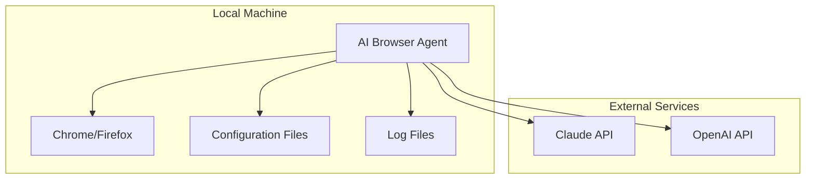

### Containerized Deployment

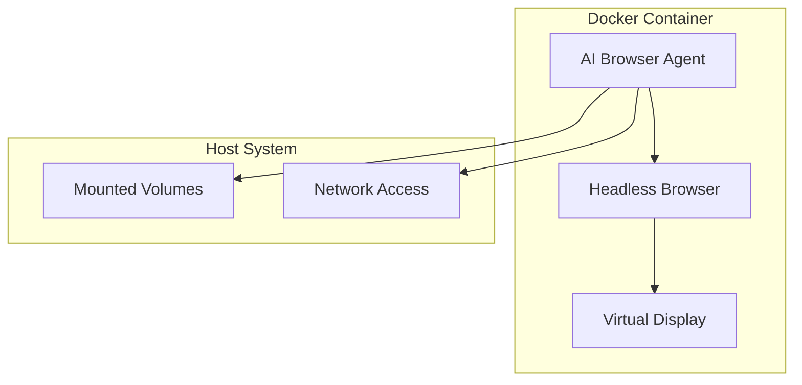

### Distributed Deployment

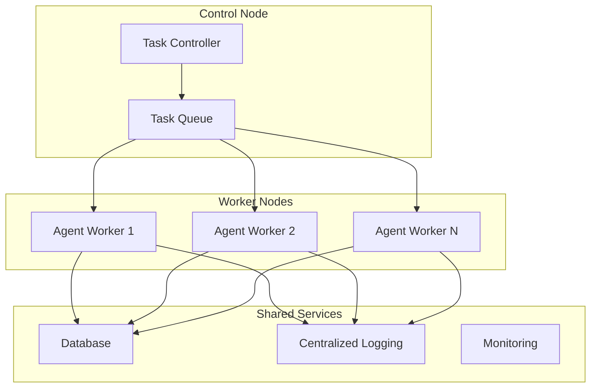

---

## Quality Attributes

### Reliability
- Comprehensive error handling and recovery
- Automatic retry mechanisms with exponential backoff
- Graceful degradation when components fail
- Health monitoring and self-healing capabilities

### Scalability
- Stateless component design
- Horizontal scaling support
- Resource pooling and management
- Load balancing capabilities

### Maintainability
- Modular architecture with clear interfaces
- Comprehensive logging and monitoring
- Configuration-driven behavior
- Extensive test coverage

### Security
- Multi-layered security validation
- Comprehensive audit logging
- Principle of least privilege
- Secure credential management

### Performance
- Efficient resource utilization
- Optimized AI model usage
- Intelligent caching strategies
- Asynchronous processing where appropriate

This architecture provides a solid foundation for building a reliable, secure, and extensible AI browser automation system while maintaining clear separation of concerns and supporting future growth and modifications.